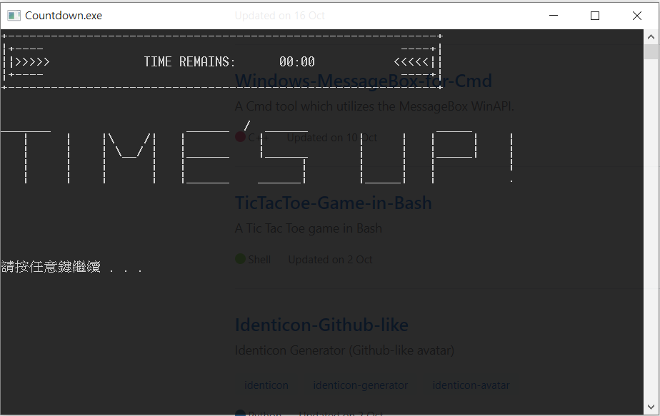

# Countdown Timer

## Usage:

`countdown.exe (minutes (seconds)) - The default value is 30 minutes.`

## Features:

- Accept user-specified arguments as the countdown duration.

- Recalculate each waiting interval, in order for the clock to be more accurate.

## Screenshot:

*Ascii work created by davidhcefx.*
